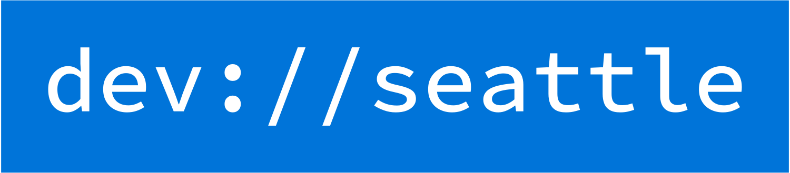

# devseattle.com

[](https://devseattle.com)

## Welcome to the DevSeattle Community!

This is a community for developers in the Seattle area to connect, share, and learn from each other. This repository is the home of the DevSeattle website.

[](https://discord.gg/6Rs9Fn395q)

Join us on [Discord](https://discord.gg/6Rs9Fn395q) to connect with other developers in the Seattle area!

## Contributing

We welcome contributions from anyone who wants to help make DevSeattle a great community. If you have an idea for a new feature, a bug fix, or just a suggestion for how we can improve, please open an issue or a pull request. We'd love to hear from you!

## Getting Started

To get start with the DevSeattle website, you'll need to have [Hugo](https://gohugo.io/) installed on your machine. Once you have Hugo installed, you can clone this repository and run the following commands to start the development server:

```bash
hugo server
```

This will start a local development server at `http://localhost:1313/` where you can preview your changes.

The website theme can be updated by running the following command:

```bash
hugo mod get -u
```

## License

This project is licensed under the [MIT License](LICENSE).
